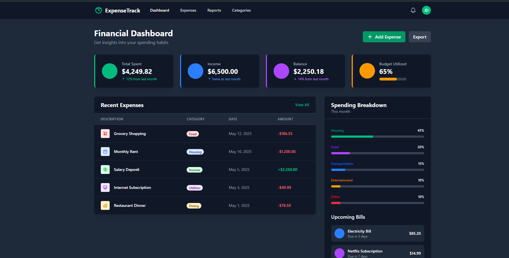

# 📊 TrackIt – Expense Tracker Web App

Welcome to **TrackIt**, a modern and minimalistic 💸 Expense Tracker built using **Ruby on Rails**. Manage your income and expenses, visualize your financial health with graphs 📈, and keep everything organized with categories.

---

## 🌟 Features

* 🔐 User authentication (Sign Up / Login / Logout)
* ➕ Add, ✏️ Edit, and ❌ Delete Income & Expense entries
* 🏷️ Categorize your transactions (Food, Travel, etc.)
* 📅 Filter transactions by date and category
* 📊 View analytics dashboard with charts (monthly, yearly)
* 📥 Export to CSV
* 🌐 Responsive Design with Bootstrap

---

## 🚀 Tech Stack

| Tech                     | Description          |
| ------------------------ | -------------------- |
| 💎 Ruby on Rails         | Backend Framework    |
| 🗃️ SQLite / PostgreSQL  | Database             |
| 🎨 Bootstrap             | Frontend Styling     |
| 📈 Chartkick + Groupdate | Graphs and Analytics |
| 🔑 Devise                | User Authentication  |

---

## 📁 Project Structure

```bash
TrackIt/
├── app/
│   ├── controllers/
│   ├── models/
│   ├── views/
├── config/
├── db/
├── public/
├── Gemfile
└── README.md
```

---

## ✅ Task List

### 🚧 Development Tasks

* [x] Initialize Rails project
* [x] Set up Devise authentication system
* [x] Create User, Transaction, and Category models
* [x] Configure database and relationships
* [x] Build CRUD operations for Transactions
* [x] Implement Category management
* [x] Apply filters by date, type, and category
* [x] Display dashboard with analytics charts
* [x] Implement data export feature (CSV)
* [x] Add basic validations and error handling
* [ ] Setup RSpec for testing
* [ ] Write unit and integration tests

### 🎨 UI/UX Tasks

* [x] Style UI using Bootstrap
* [x] Create responsive layout
* [ ] Add light/dark mode toggle 🌗
* [ ] Animate chart elements 🎞️
* [ ] Add icons and tooltips for accessibility

### 🌐 Deployment Tasks

* [ ] Prepare production config
* [ ] Deploy to Heroku / Render
* [ ] Add SSL, favicon, and page metadata

---

## 📷 Screenshots



---

## 🛠️ Installation

```bash
git clone https://github.com/yourusername/trackit.git
cd trackit
bundle install
yarn install --check-files
rails db:create db:migrate
rails server
```

---

## 🙌 Contribution

Pull requests are welcome! For major changes, please open an issue first.

---

## 📝 License

MIT License © 2025

---

Made with 💖 by Habibees
